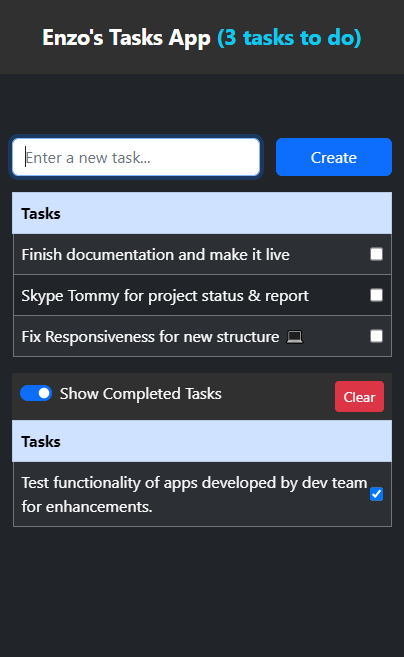

# React Task App

- Based on Vite
- React Hooks
- LocalStorage
- Bootstrap



## Development

From your terminal:

```sh
npm run dev
```

This starts your app in development mode, rebuilding assets on file changes.

## Deployment

First, build your app for production:

```sh
npm run build
```
